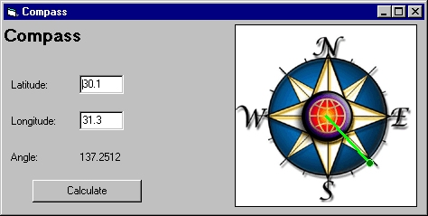



## Compass and Qibla Direction Calculator

### Description

This Compass calculates and displays Qibla Direction Compass, the Great Circle Distance and Great Circle Direction. This is a general Compass which can be used to calculate and display the distance between any two points on the Earth and the direction from one point to any other point.
 
### More Info
 

             |
---                |---
**Submitted On**   |2006-05-13 16:55:50
**By**             |[Ahmed Amin Elsheshtawy](https://github.com/Planet-Source-Code/PSCIndex/blob/master/ByAuthor/ahmed-amin-elsheshtawy.md)
**Level**          |Intermediate
**User Rating**    |5.0 (30 globes from 6 users)
**Compatibility**  |VB 3\.0, VB 4\.0 \(16\-bit\), VB 4\.0 \(32\-bit\), VB 5\.0, VB 6\.0, VB Script, ASP \(Active Server Pages\) , VBA MS Access, VBA MS Excel
**Category**       |[Complete Applications](https://github.com/Planet-Source-Code/PSCIndex/blob/master/ByCategory/complete-applications__1-27.md)
**World**          |[Visual Basic](https://github.com/Planet-Source-Code/PSCIndex/blob/master/ByWorld/visual-basic.md)
**Archive File**   |[Compass1993685132006\.zip](https://github.com/Planet-Source-Code/ahmed-amin-elsheshtawy-compass-and-qibla-direction-calculator__1-65312/archive/master.zip)

